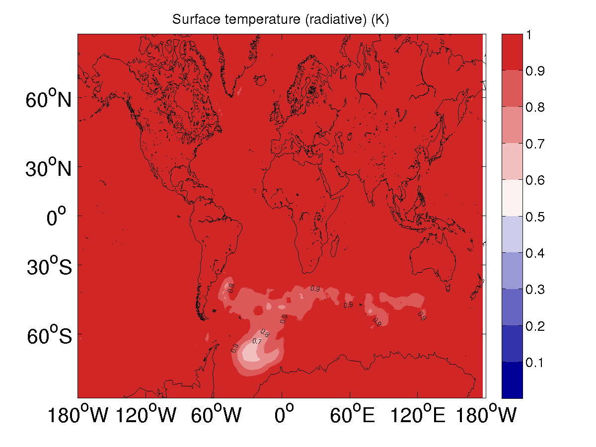
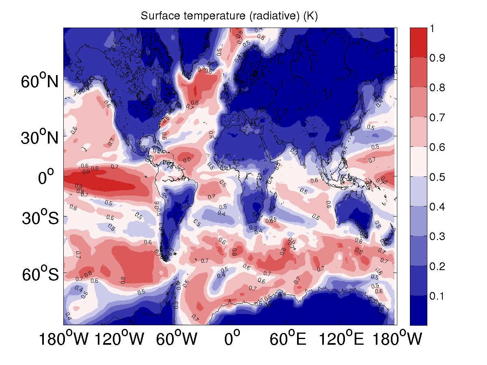
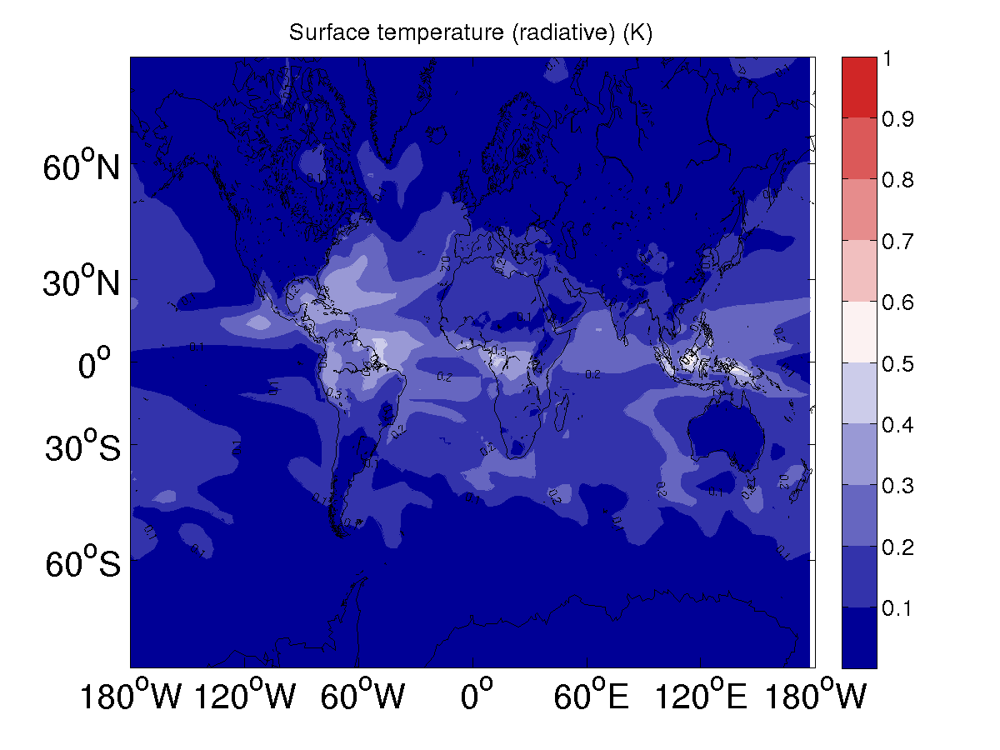
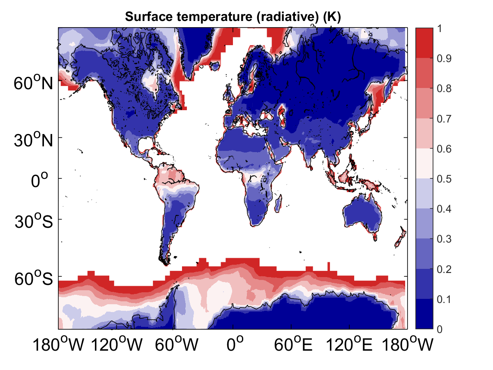
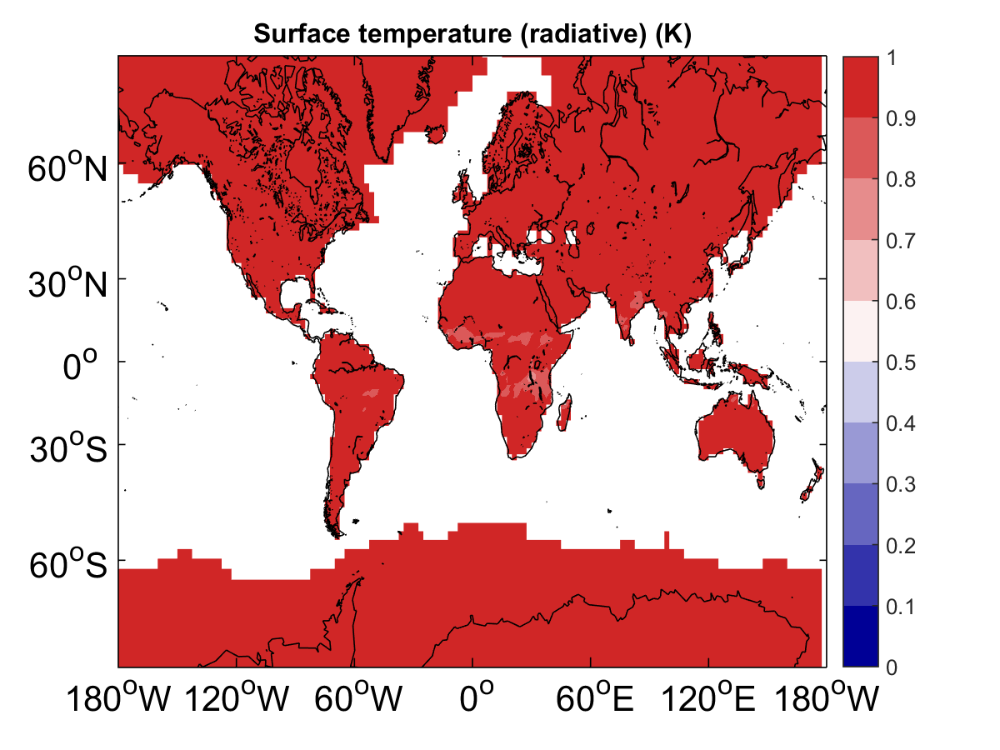
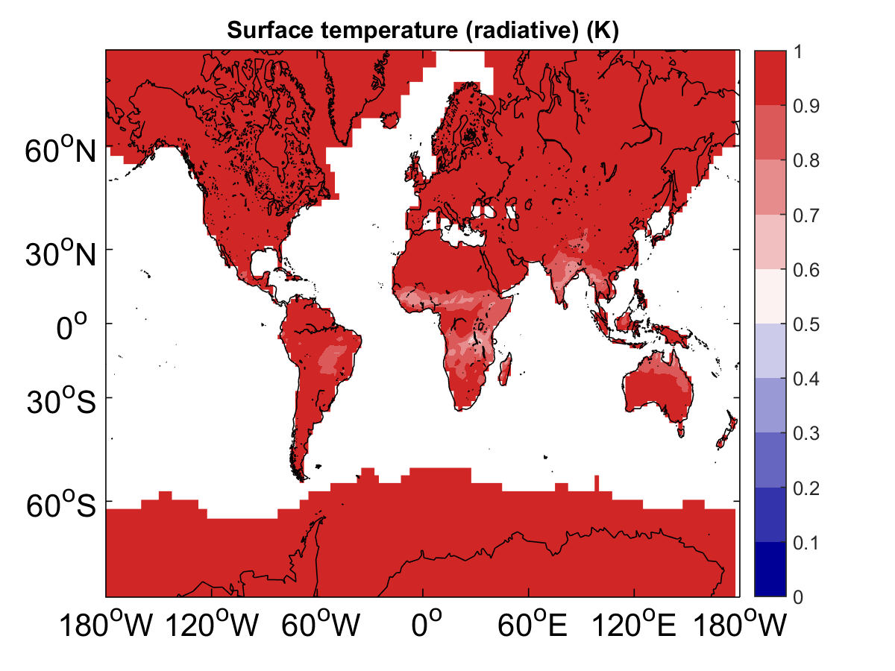
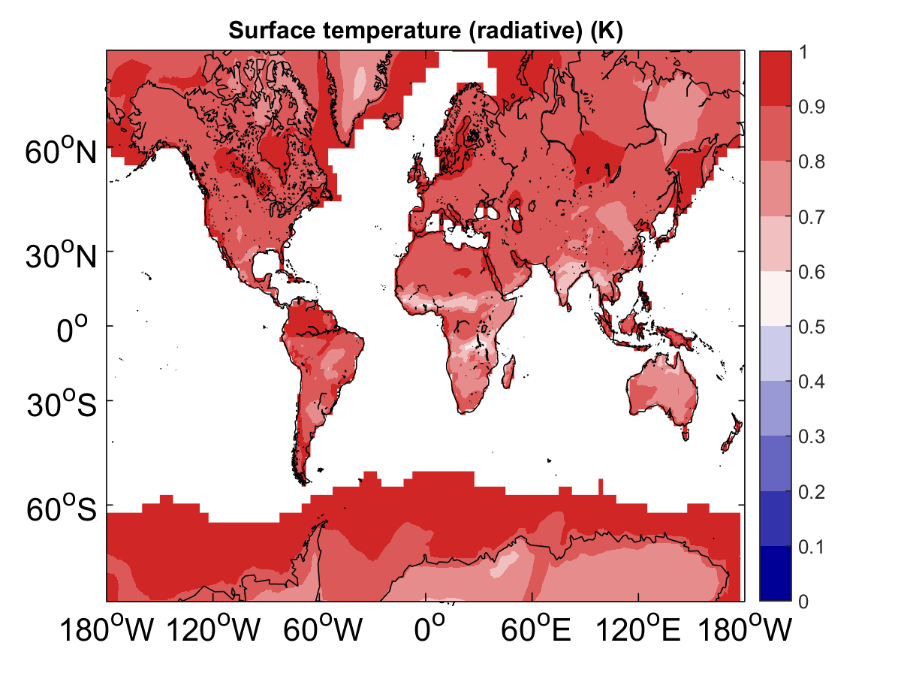
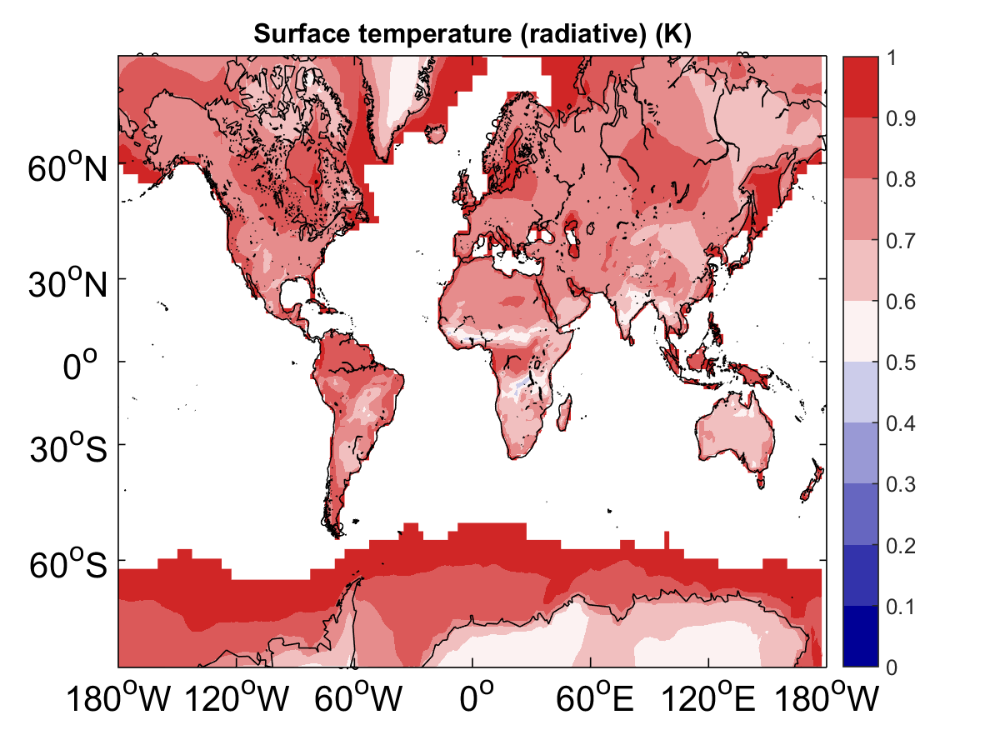
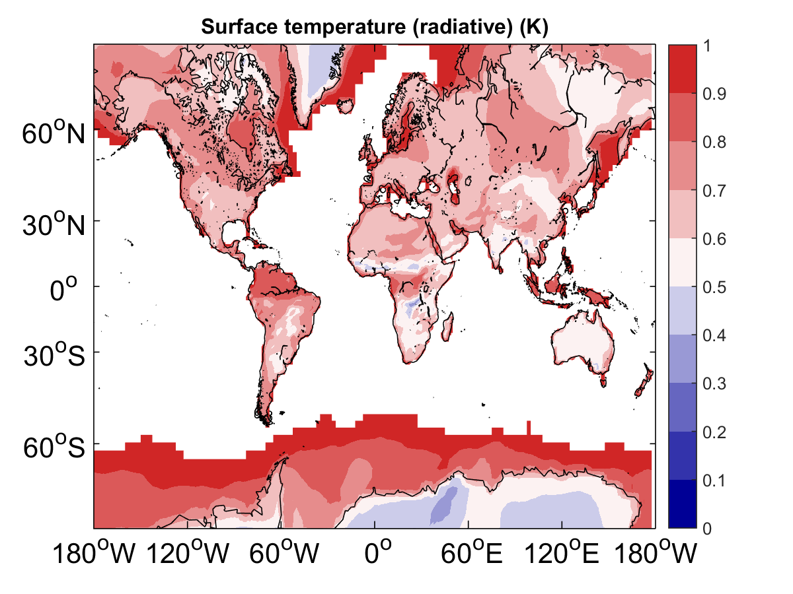
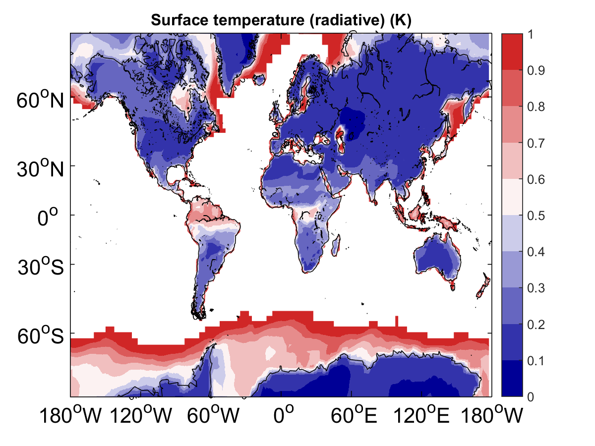

The Results of Applying Potential Predictability (PP)
==========
>> For calculating Potential Predictability (PP) on nostore-oslo 
>> Mainly evaluating if the system is well constrained. 

Author: Mao-Lin Shen (E-mail: maolin.shen@uib.no)

  * Figures of the PPP for different levels are not shown because there are too many levels and GitHub can only present the web-page if the page size is smaller than 1MB.

## Analysis:
--------------------------------------
* ### [Full Profile assimilated Ocean and State-nudged Atmosphere of NorESM (1st version)](docs/FrontPage_FF_ini_try.md)

  * About this analysis:
    * __Finished on ?? ?? 2016__
    * Have to wait for Yiguo Wang's work on full profiled assimilation
    * More details can be found in the [description page](docs/FrontPage_FF_ini_try.md)
    * PPP of SST 

--------------------------------------
* ### [Full Profile assimilated Ocean of NorESM (1st version)](docs/FrontPage.markdown)

  * About this analysis:
    * __Finished on ?? ?? 2016__
    * Have to wait for Yiguo Wang's work on full profiled assimilation
    * More details can be found in the [description page](docs/FrontPage.markdown)
    * PPP of SST 

--------------------------------------
* ### [Full field SST assimilated Ocean of NorESM (3rd version)](docs/FrontPage_FF_3rd_try.markdown)

  * About this analysis:
    * __Finished on 28 Jan 2016__
    * More details can be found in the [description page](docs/FrontPage_FF_3rd_try.markdown)
    * PPP of air surface temperature 

--------------------------------------
* ### [Full field SST assimilated Ocean of NorESM (2nd version)](docs/FrontPage_FF_2nd_try.markdown)

  * About this analysis:
    * __Finished on 20 Dec 2015__
    * More details can be found in the [description page](docs/FrontPage_FF_2nd_try.markdown)
    * PPP of air surface temperature 

--------------------------------------
* ### [Full field SST assimilated Ocean of NorESM (1st version)](docs/FrontPage_FF_ini_try.markdown)

  * About this analysis:
   * __Finished on 18 Apr. 2015__
   * More details can be found in the [description page](docs/FrontPage_FF_ini_try.markdown)
   * PPP of  air surface temperature

--------------------------------------
* ### [Uninitialized NorESM (histrical forcing only)](docs/FrontPage_Historical_forcing_ens.markdown)

  * About this analysis:
   * __Finished on 10 Mar. 2014__
   * More details can be found in the [description page](docs/FrontPage_Historical_forcing_ens.markdown)
   * PPP of air surface temperature 

--------------------------------------
* ### [AMIP run](docs/FrontPage_normal_AMIP.markdown)

  * About this analysis:
   * __Finished on 13 Feb. 2016__
   * More details can be found in the [description page](docs/FrontPage_normal_AMIP.markdown)
   * PPP of air surface temperature 

--------------------------------------
* ### [AMIP with 1-day atmospheric nudging](docs/FrontPage_n01d_AMIP.markdown)

  * About this analysis:
   * __Finished on 12 Feb. 2016__
   * More details can be found in the [description page](docs/FrontPage_n01d_AMIP.markdown)
   * PPP of air surface temperature 

--------------------------------------
* ### [AMIP with 2-day atmospheric nudging](docs/FrontPage_n02d_AMIP.markdown)

  * About this analysis:
   * __Finished on ?? Feb. 2016__
   * More details can be found in the [description page](docs/FrontPage_n02d_AMIP.markdown)
   * PPP of air surface temperature 

--------------------------------------
* ### [AMIP with 3-day atmospheric nudging](docs/FrontPage_n03d_AMIP.markdown)

  * About this analysis:
   * __Finished on ?? Feb. 2016__
   * More details can be found in the [description page](docs/FrontPage_n03d_AMIP.markdown)
   * PPP of air surface temperature 

--------------------------------------
* ### [AMIP with 4-day atmospheric nudging](docs/FrontPage_n04d_AMIP.markdown)

  * About this analysis:
   * __Finished on ?? Feb. 2016__
   * More details can be found in the [description page](docs/FrontPage_n04d_AMIP.markdown)
   * PPP of air surface temperature 

--------------------------------------
* ### [AMIP with 5-day atmospheric nudging](docs/FrontPage_n05d_AMIP.markdown)

  * About this analysis:
   * __Finished on 18 Feb. 2016__
   * More details can be found in the [description page](docs/FrontPage_n05d_AMIP.markdown)
   * PPP of air surface temperature 

--------------------------------------
* ### [AMIP with 30 day atmospheric nudging](docs/FrontPage_n30d_AMIP.markdown)

  * About this analysis:
   * __Finished on 17 Feb. 2016__
   * More details can be found in the [description page](docs/FrontPage_n30d_AMIP.markdown)
   * PPP of air surface temperature 

