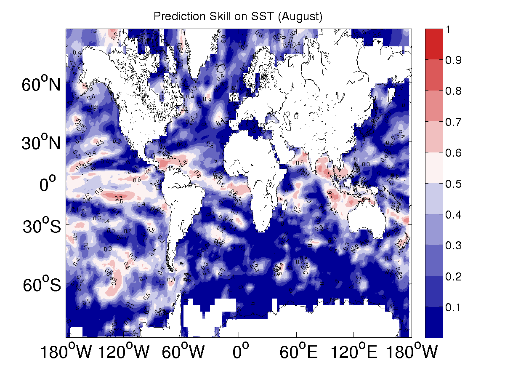

Full field SST assimilated Ocean of NorESM (1st version)
==========

  * The results (in global map) can be found in the following pages. Note that the results won't be shown if the PPP is smaller than __0.001__.

    * [__MICOM__](FF_ini_try/PPP_ocn.markdown), presented/total figures in ocn: __24__/1053 
    * [__CAM__](FF_ini_try/PPP_atm.markdown), presented/total figures in atm: __82__/3432 
    * [__CLM__](FF_ini_try/PPP_lnd.markdown), presented/total figures in lnd: __141__/211 
    * [__CICE__](FF_ini_try/PPP_ice.markdown), presented/total figures in ice: __8__/104 

  * About this analysis:
    * __Finished on 18 Apr. 2015__
    * Data is kept @Norstore-osl:/tape/NS9207K/earnest/NorCPM/FF_ini_try_tar/
    * We use [Norwegian Earth System Model (NorESM)](http://folk.uib.no/ngfhd/EarthClim/) version F19_tn21 (approximately two degree atmosphere and two degree ocean)
    * Applying full-field SST ([HadISST2](http://www.metoffice.gov.uk/hadobs/hadisst2/)) assimilation ([EnKF](http://enkf.nersc.no/), 30 members) on ocean compartment only
    * From __1980-2007__
    * Known issue: skill lost due to one-grid shift in preparing SST data. It also implies that the PPP of ensemble members is not really robust. 
    * PPP cannot identify this skill loose because the noise is calculated base on the ensemble mean. 
    * Redefine the noise as the spread to observation (SST) can identify this skill loose. 
  * PPP of SST 
  * PPP (against observation) of SST 
  * Prediction Skill of SST 
  * Notes on this prediction:

